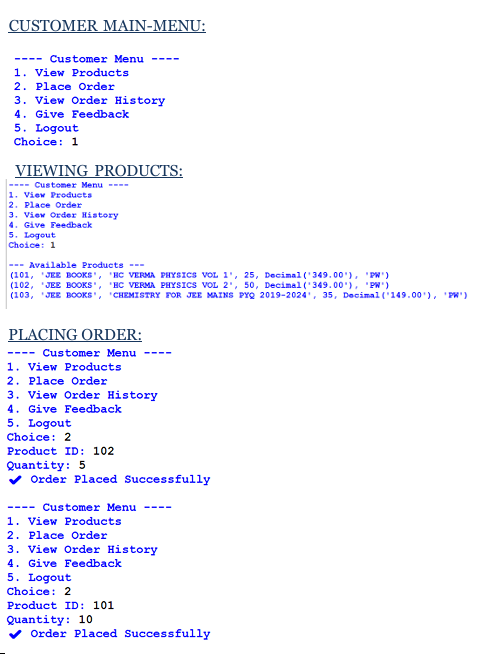
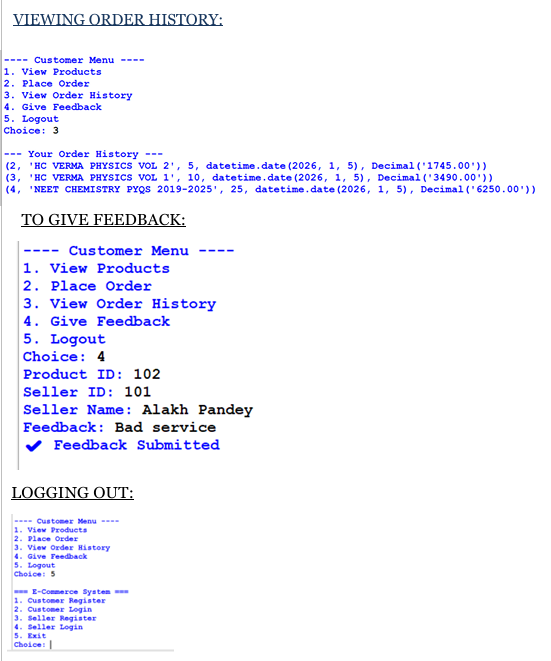
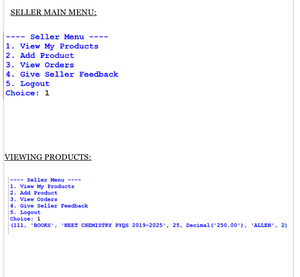
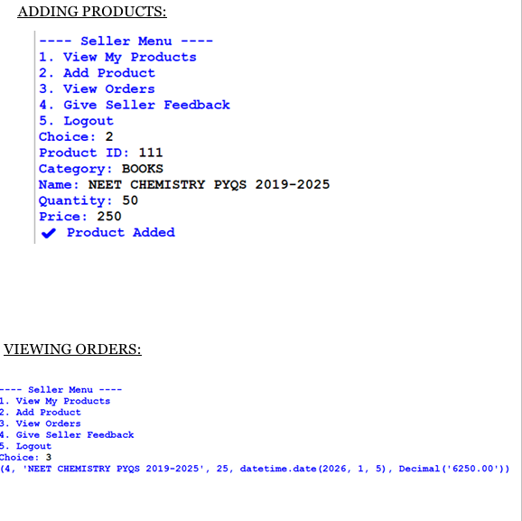

# Shopping System — Python & MySQL

A console-based E-Commerce Management System developed using Python and MySQL as a **Class 12 CBSE Computer Science academic project**.

## Features

### Customer

* Customer registration and login
* View available products
* Place orders
* View order history
* Submit feedback

### Seller

* Seller registration and login
* Add and manage products
* View received orders
* Give feedback

## Technologies Used

* Python 3.x
* MySQL
* MySQL Connector for Python

## Requirements

* Python 3.x
* MySQL Server
* MySQL Connector for Python

## Installation

1. Clone or download this repository.
2. Install Python 3.x.
3. Install MySQL Server.
4. Import `shopping_database.sql` into MySQL.
5. Make sure the required `ecommerce` database is available.
6. Install the required MySQL connector package.
7. Open the project in VS Code or another Python IDE.
8. Run `shopping system.py`.
9. Enter your own MySQL password when prompted.

## Project Structure

```text
Shopping-System-Python/
├── shopping system.py
├── shopping_database.sql
├── README.md
├── screenshot/
│   ├── customer_shopping_flow.png
│   ├── customer_orders_feedback.png
│   ├── seller_products.png
│   └── seller_orders_management.png
└── docs/
    └── CS PROJECT ECOMMERCE 2025-26-1.pdf
```

## Screenshots

### Customer Shopping Flow



### Customer Orders & Feedback



### Seller Products



### Seller Orders Management



## Project Documentation

The complete Class 12 CBSE Computer Science project report is available here:

[View Project Documentation](docs/CS%20PROJECT%20ECOMMERCE%202025-26-1.pdf)

## Future Improvements

* GUI version using Tkinter
* Better product search
* Admin dashboard
* Password encryption
* Email verification
* Online payment support
* Product search filters
* Inventory management
* User profile management

## Author

**Yatharth Jindal**

## Project Type

**Class 12 CBSE Computer Science Academic Project**

## License

This project was created for educational purposes.

